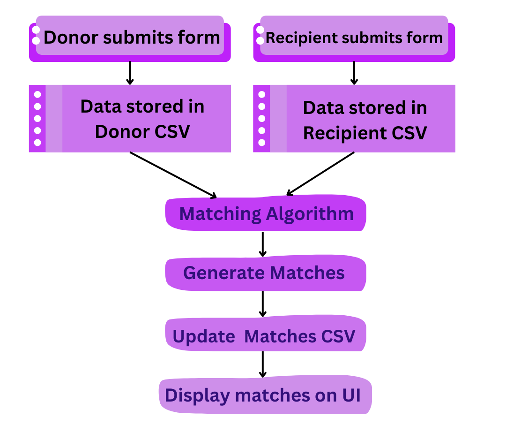

# ByteMe-11-SUSTAIN-AI-THON
# **Smart Food Waste Management System**
## **Brief Introduction**
The **Smart Food Waste Management System** is a platform designed to minimize food wastage by connecting food donors with recipients in need. This system streamlines the process of matching surplus food from donors (restaurants, cafes, etc.) with organizations or individuals who can utilize it efficiently. The project also incorporates a matching algorithm that considers food type, quantity, location, and urgency to ensure effective distribution. The project also incorporates an algorithm which predicts the future response of the donor and matches it with the recipients need.

## **Workflow Diagram**

## **Concept map**
   Donor Interface: A form for donors to submit food details like type, quantity, and location.
   Recipient Interface: A form for recipients to specify their requirements.
   Backend:
       Handles data submission and storage.
       Implements the matching algorithm.(Decision Tree and Random Forest)
       Implements the future prediction algorithm.(ANN and Random Forest)
       Generates match results.
   Frontend:Displays match results to users.
   
## **Tech Stack**
### **Frontend**
- **HTML** and **CSS**: User interfaces for donors, recipients and matches.
- **JavaScript**: Form validation and interaction.

### **Backend**
- **Node.js** with **Express.js**: Handles API endpoints and processes donor-recipient matching.
- **Python**: For AI/ML-based match and future prediction.

### **Database/Storage**
- **CSV Files**: Temporary storage for donor, recipient, and match data.
  
## **Novelty**
- **AI Integration:** Uses AI to improve donor-recipient matches based on dynamic criteria like food type, location, and urgency.
- **Scalable Design:** Can be expanded to include real-time notifications and dynamic routing.
- **Impactful Solution:** Addresses the global issue of food waste with a simple, yet effective system.
 
## **Solution**
### **Problem Statement**
Billions of tons of food are wasted globally while millions face hunger. There's an urgent need for an optimized food redistribution system.

### **Our Solution**
- **Donor Form:** Easy-to-use interface to submit surplus food details.
- **Recipient Form:** Enables recipients to specify food requirements.
- **AI Matching Algorithm:** Matches donors with recipients efficiently.
- **Results Page:** Displays real-time match results for donors and recipients.

## **Other Features**
- **Future Upgrades:**
  - Integration with Google Maps for route optimization.
  - Push notifications for matches.
  - Real-time chat between donors and recipients.

- **Extensibility:**
  - Can be tailored for specific regions.
  - Supports multiple languages for broader reach.
    
